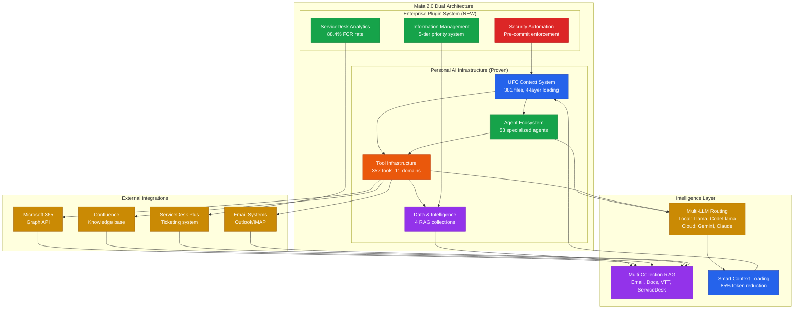
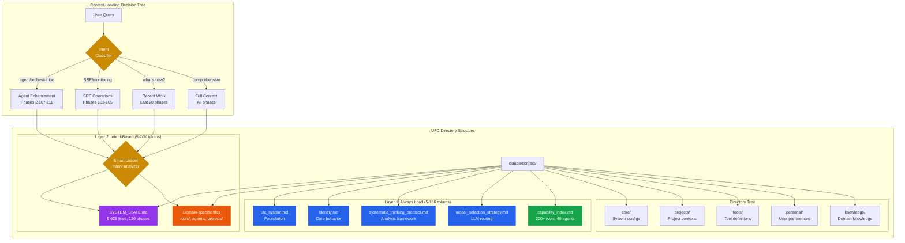
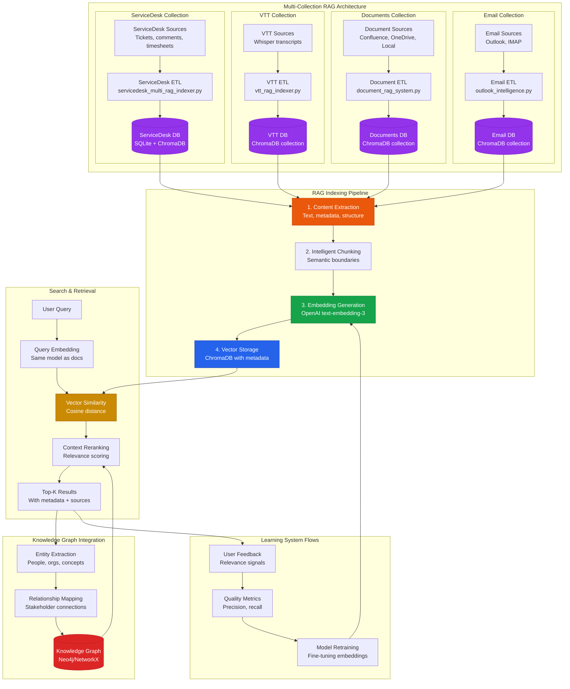
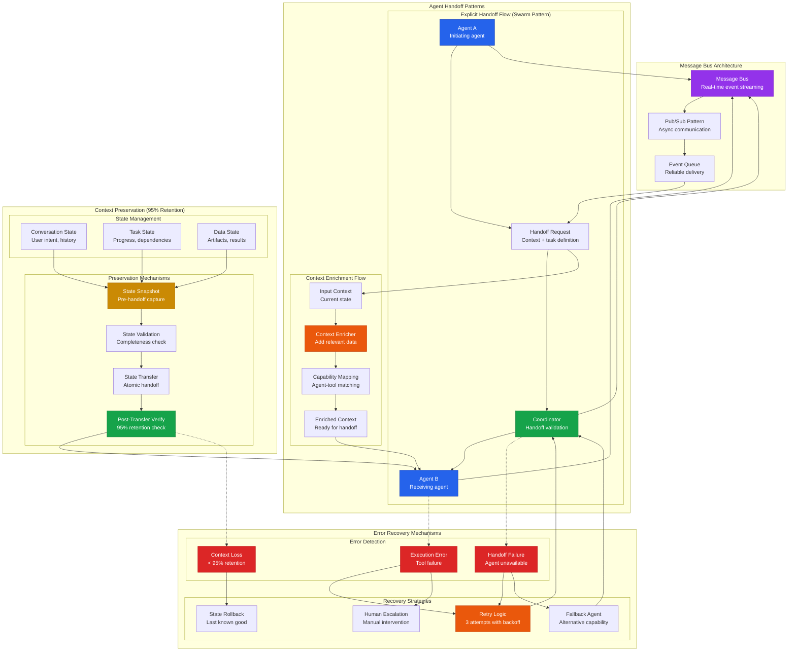

```mermaid
graph TB
    subgraph "Agent Orchestration Framework"
        SWARM[Swarm Orchestration<br/>Explicit handoffs]
        COORDINATOR[Coordinator Agent<br/>Routing & task decomposition]
        CONTEXT_MGR[Context Manager<br/>95% retention across handoffs]
    end

    subgraph "53 Specialized Agents - 10 Domains"

        subgraph "Information Management (3)"
            INFO_ORCH[Info Mgmt Orchestrator<br/>7 tool coordination]
            STAKEHOLDER[Stakeholder Intelligence<br/>0-100 health scoring]
            DECISION[Decision Intelligence<br/>Outcome tracking]
        end

        subgraph "SRE & DevOps (3)"
            SRE[SRE Principal Engineer<br/>Incident response, chaos]
            DEVOPS[DevOps Architect<br/>CI/CD, IaC]
            ENDPOINT[Endpoint Engineer<br/>Device management]
        end

        subgraph "Security & Identity (2)"
            SECURITY[Security Specialist<br/>Vulnerability assessment]
            IDAM[IDAM Engineer<br/>Access management]
        end

        subgraph "Cloud & Infrastructure (2)"
            AZURE[Azure Solutions Architect<br/>Cloud architecture]
            M365[M365 Integration<br/>Enterprise automation]
        end

        subgraph "Recruitment & HR (3)"
            TECH_REC[Technical Recruitment<br/>MSP/cloud hiring]
            CONST_REC[Construction Recruitment<br/>Sector specialist]
            INTERVIEW[Interview Prep<br/>Preparation coach]
        end

        subgraph "Business & Analysis (5)"
            COMPANY[Company Research<br/>Intelligence gathering]
            GOVERNANCE[Governance Engine<br/>ML-enhanced policy]
            SERVICEDESK[ServiceDesk Manager<br/>Escalation & RCA]
            PRODUCT[Product Manager<br/>Strategy & roadmap]
            BUSINESS_ANALYST[Business Analyst<br/>Requirements & analysis]
        end

        subgraph "Content & Communication (5)"
            TEAM_KNOWLEDGE[Team Knowledge Sharing<br/>Onboarding materials]
            CONFLUENCE[Confluence Organization<br/>Space management]
            LINKEDIN[LinkedIn Advisor<br/>Content optimization]
            BLOG[Blog Writer<br/>Content creation]
            TECH_WRITER[Technical Writer<br/>Documentation]
        end

        subgraph "Career & Finance (3)"
            JOBS[Jobs Agent<br/>Search & analysis]
            LINKEDIN_OPT[LinkedIn Optimizer<br/>Profile enhancement]
            FINANCIAL[Financial Advisor<br/>Planning & guidance]
        end

        subgraph "Personal & Lifestyle (5)"
            HOLIDAY[Holiday Research<br/>Travel planning]
            TRAVEL[Travel Monitor<br/>Alerts & tracking]
            RESTAURANT[Restaurant Discovery<br/>Perth local intel]
            ASSISTANT[Personal Assistant<br/>Task management]
            UX[UX Designer<br/>Interface design]
        end

        subgraph "AI & Engineering (18)"
            PROMPT[Prompt Engineer<br/>Optimization specialist]
            TOKEN[Token Optimization<br/>Efficiency expert]
            AI_SPEC[AI Specialists<br/>System design]
            DEVELOPER[Developer Agent<br/>Software development]
            DNS[DNS Specialist<br/>Configuration & troubleshooting]
            ARCHITECT[Software Architect<br/>System design]
            DATA_ENG[Data Engineer<br/>Pipeline & ETL]
            DEVOPS_AGENT[DevOps Agent<br/>Automation]
            SALES_ENG[Sales Engineer<br/>Technical sales]
            CUSTOMER[Customer Success<br/>Support & adoption]
            DATA_ANALYST[Data Analyst<br/>Analytics & insights]
            PROJ_MGR[Project Manager<br/>Delivery & coordination]
            RESEARCHER[Researcher<br/>Investigation & analysis]
            MARKETING[Marketing Strategist<br/>GTM & campaigns]
            UI_SYSTEMS[UI Systems Agent<br/>Design systems]
        end
    end

    subgraph "Agent-Tool Separation"
        TOOLS[352 Tools<br/>11 emoji domains]
        CAPABILITY_REG[Capability Registry<br/>Agent-tool mapping]
    end

    COORDINATOR --> SWARM
    SWARM --> CONTEXT_MGR

    SWARM --> INFO_ORCH
    SWARM --> SRE
    SWARM --> SECURITY
    SWARM --> AZURE
    SWARM --> TECH_REC
    SWARM --> COMPANY
    SWARM --> TEAM_KNOWLEDGE
    SWARM --> JOBS
    SWARM --> HOLIDAY
    SWARM --> PROMPT

    INFO_ORCH --> STAKEHOLDER
    INFO_ORCH --> DECISION

    AI_SPEC --> PROMPT
    AI_SPEC --> TOKEN
    AI_SPEC --> DEVELOPER

    COORDINATOR --> CAPABILITY_REG
    CAPABILITY_REG --> TOOLS

    STAKEHOLDER --> TOOLS
    SRE --> TOOLS
    SECURITY --> TOOLS
    SERVICEDESK --> TOOLS

    style SWARM fill:#9333ea,stroke:#7e22ce,color:#fff
    style COORDINATOR fill:#16a34a,stroke:#15803d,color:#fff
    style CONTEXT_MGR fill:#2563eb,stroke:#1e40af,color:#fff
    style INFO_ORCH fill:#16a34a,stroke:#15803d,color:#fff
    style SRE fill:#dc2626,stroke:#b91c1c,color:#fff
    style SECURITY fill:#dc2626,stroke:#b91c1c,color:#fff
    style AZURE fill:#ca8a04,stroke:#a16207,color:#fff
    style AI_SPEC fill:#9333ea,stroke:#7e22ce,color:#fff
    style TOOLS fill:#ea580c,stroke:#c2410c,color:#fff
    style CAPABILITY_REG fill:#2563eb,stroke:#1e40af,color:#fff
```

```mermaid
graph TB
    subgraph "Tool Discovery Mechanisms"
        CAP_INDEX[capability_index.md<br/>Always-loaded registry<br/>200+ tools, quick search]
        CAP_CHECKER[capability_checker.py<br/>Deep search tool<br/>SYSTEM_STATE + available.md]
        CAP_ENFORCER[capability_check_enforcer.py<br/>Automated Phase 0<br/>Prevents duplicates]
    end

    subgraph "352 Tools - 11 Emoji Domains"

        subgraph "🔒 Security & Compliance (15)"
            SEC1[save_state_security_checker.py<br/>Pre-commit validation]
            SEC2[security_orchestration_service.py<br/>Automated scans]
            SEC3[security_intelligence_dashboard.py<br/>8-widget monitoring]
            SEC4[ufc_compliance_checker.py<br/>Structure validation]
            SEC5[osv_scanner.py<br/>Vulnerability detection]
        end

        subgraph "⚙️ SRE & Reliability (29)"
            SRE1[save_state_preflight_checker.py<br/>161 checks]
            SRE2[automated_health_monitor.py<br/>System validation]
            SRE3[dependency_graph_validator.py<br/>Phantom tool detection]
            SRE4[disaster_recovery_system.py<br/>Backup + OneDrive sync]
            SRE5[smart_context_loader.py<br/>Intent-aware loading]
            SRE6[capability_checker.py<br/>Capability search]
            SRE7[capability_check_enforcer.py<br/>Phase 0 automation]
        end

        subgraph "📊 ServiceDesk & Analytics (10)"
            SD1[servicedesk_multi_rag_indexer.py<br/>Multi-collection RAG]
            SD2[servicedesk_complete_quality_analyzer.py<br/>Comment quality scoring]
            SD3[servicedesk_operations_dashboard.py<br/>Flask analytics]
            SD4[servicedesk_etl_system.py<br/>Incremental ETL]
        end

        subgraph "📋 Information Management (15)"
            INFO1[executive_information_manager.py<br/>5-tier priority]
            INFO2[stakeholder_intelligence.py<br/>CRM-style 0-100 scoring]
            INFO3[decision_intelligence.py<br/>Decision tracking]
            INFO4[enhanced_daily_briefing_strategic.py<br/>Executive intelligence]
            INFO5[meeting_context_auto_assembly.py<br/>80% time reduction]
            INFO6[unified_action_tracker_gtd.py<br/>GTD workflow]
        end

        subgraph "🎤 Voice & Transcription (8)"
            VOICE1[whisper_dictation_server.py<br/>Real-time dictation]
            VOICE2[vtt_watcher.py<br/>File monitoring]
            VOICE3[vtt_rag_indexer.py<br/>RAG indexing]
            VOICE4[downloads_vtt_mover.py<br/>Auto-move from Downloads]
        end

        subgraph "🔗 Productivity & Integration (20)"
            PROD1[confluence_sync.py<br/>Content sync]
            PROD2[reliable_confluence_client.py<br/>SRE-grade API client]
            PROD3[microsoft_graph_integration.py<br/>M365 Graph API]
            PROD4[outlook_intelligence.py<br/>Email intelligence]
            PROD5[teams_intelligence.py<br/>Chat analysis]
        end

        subgraph "🧠 Data & Analytics (15)"
            DATA1[rag_enhanced_search.py<br/>Multi-source RAG]
            DATA2[email_rag_system.py<br/>Semantic email search]
            DATA3[document_rag_system.py<br/>Document embeddings]
            DATA4[ai_business_intelligence_dashboard.py<br/>Business analytics]
        end

        subgraph "🤖 Orchestration Infrastructure (10)"
            ORCH1[agent_swarm.py<br/>Explicit handoffs]
            ORCH2[agent_loader.py<br/>49-agent registry]
            ORCH3[context_management.py<br/>Context preservation]
            ORCH4[agent_capability_registry.py<br/>Capability indexing]
        end

        subgraph "🧪 Development & Testing (10)"
            DEV1[fail_fast_debugger.py<br/>Local LLM debugging]
            DEV2[test_agent_swarm.py<br/>Swarm testing]
            DEV3[test_end_to_end_integration.py<br/>Integration tests]
        end

        subgraph "💰 Finance & Business (5)"
            FIN1[financial_advisor_agent_tools.py<br/>Financial analysis]
            FIN2[financial_planner_tools.py<br/>Planning tools]
        end

        subgraph "👥 Recruitment & HR (8)"
            REC1[technical_recruitment_analyzer.py<br/>Candidate analysis]
            REC2[interview_review_confluence_template.py<br/>Documentation]
            REC3[job_market_intelligence.py<br/>Market analysis]
            REC4[linkedin_profile_optimizer.py<br/>Profile optimization]
        end
    end

    subgraph "Integration Patterns"
        AGENTS_INT[Agent Integration<br/>49 agents use tools]
        API_INT[API Integration<br/>External systems]
        DATA_INT[Data Integration<br/>4 RAG collections]
    end

    CAP_INDEX --> CAP_CHECKER
    CAP_INDEX --> CAP_ENFORCER
    CAP_CHECKER --> CAP_ENFORCER

    CAP_ENFORCER --> SEC1
    CAP_ENFORCER --> SRE1
    CAP_ENFORCER --> SD1
    CAP_ENFORCER --> INFO1

    SEC1 --> SRE1
    SRE1 --> SRE2
    SRE5 --> CAP_INDEX

    SD1 --> DATA1
    INFO1 --> DATA1
    VOICE3 --> DATA1
    PROD4 --> DATA2

    ORCH1 --> AGENTS_INT
    ORCH2 --> AGENTS_INT

    PROD1 --> API_INT
    PROD3 --> API_INT
    SD1 --> API_INT

    DATA1 --> DATA_INT
    DATA2 --> DATA_INT
    DATA3 --> DATA_INT

    style CAP_INDEX fill:#16a34a,stroke:#15803d,color:#fff
    style CAP_CHECKER fill:#2563eb,stroke:#1e40af,color:#fff
    style CAP_ENFORCER fill:#dc2626,stroke:#b91c1c,color:#fff
    style SEC1 fill:#dc2626,stroke:#b91c1c,color:#fff
    style SRE1 fill:#ea580c,stroke:#c2410c,color:#fff
    style SD1 fill:#9333ea,stroke:#7e22ce,color:#fff
    style INFO1 fill:#16a34a,stroke:#15803d,color:#fff
    style VOICE1 fill:#ca8a04,stroke:#a16207,color:#fff
    style DATA1 fill:#9333ea,stroke:#7e22ce,color:#fff
    style ORCH1 fill:#2563eb,stroke:#1e40af,color:#fff
```

# Maia Visual Architecture Diagrams

**Created**: 2025-10-15
**Purpose**: Comprehensive visual documentation of Maia system architecture
**Format**: Mermaid diagrams + ASCII art + design specifications
**Total Diagrams**: 8

---

## Design System Guide

### Visual Language

**Component Shapes**:
- 🔷 **Rectangle** = Tools, utilities, executables
- 🔶 **Rounded Rectangle** = Agents, intelligent systems
- 🗄️ **Cylinder** = Data storage, databases, collections
- ◆ **Diamond** = Decision points, routing logic
- ⭕ **Circle** = External systems, APIs
- 📦 **Hexagon** = Frameworks, orchestration systems

**Color Palette** (Color-blind safe):
- **Blue (#2563eb)**: Core infrastructure, UFC system
- **Green (#16a34a)**: Agents, intelligence systems
- **Orange (#ea580c)**: Tools, executables
- **Purple (#9333ea)**: Data & RAG systems
- **Red (#dc2626)**: Security, enforcement
- **Yellow (#ca8a04)**: External integrations
- **Gray (#475569)**: Supporting systems

**Pattern Library**:
- Solid lines = Direct dependencies
- Dashed lines = Optional/conditional flows
- Bold lines = Primary data flows
- Dotted lines = Monitoring/observability

---

## Diagram 1: High-Level System Architecture

### Mermaid Code



### ASCII Art Version

```
┌─────────────────────────────────────────────────────────────────────┐
│                  MAIA 2.0 DUAL ARCHITECTURE                         │
├─────────────────────────────────────────────────────────────────────┤
│                                                                     │
│  ┌──────────────────────────┐  ┌──────────────────────────┐       │
│  │ PERSONAL AI (Proven)     │  │ ENTERPRISE PLUGINS (New) │       │
│  ├──────────────────────────┤  ├──────────────────────────┤       │
│  │ ▪ UFC Context System     │  │ ▪ ServiceDesk Analytics  │       │
│  │   (381 files, 4 layers)  │  │   (88.4% FCR rate)       │       │
│  │                          │  │                          │       │
│  │ ▪ Agent Ecosystem        │  │ ▪ Information Mgmt       │       │
│  │   (53 agents)            │  │   (5-tier priority)      │       │
│  │                          │  │                          │       │
│  │ ▪ Tool Infrastructure    │  │ ▪ Security Automation    │       │
│  │   (352 tools, 11 domains)│  │   (Pre-commit hooks)     │       │
│  │                          │  │                          │       │
│  │ ▪ Data & Intelligence    │  └──────────────────────────┘       │
│  │   (4 RAG collections)    │                                     │
│  └──────────────────────────┘                                     │
│                                                                     │
│  ┌──────────────────────────────────────────────────────┐         │
│  │            INTELLIGENCE LAYER                        │         │
│  ├──────────────────────────────────────────────────────┤         │
│  │ Multi-LLM Routing │ Multi-RAG │ Smart Context       │         │
│  │ (99.3% savings)   │ (4 types) │ (85% reduction)     │         │
│  └──────────────────────────────────────────────────────┘         │
│                          ▲                                         │
│                          │                                         │
│  ┌───────────────────────┴──────────────────────────┐            │
│  │         EXTERNAL INTEGRATIONS                    │            │
│  ├──────────────────────────────────────────────────┤            │
│  │ M365 │ Confluence │ ServiceDesk │ Email Systems  │            │
│  └──────────────────────────────────────────────────┘            │
│                                                                     │
└─────────────────────────────────────────────────────────────────────┘

Data Flow:
  UFC → Agents → Tools → Data → RAG → Intelligence → Context → UFC
  External Systems → RAG → Intelligence
```

### Design Description

**Layout**: Three-tier hierarchical architecture with clear separation of concerns
- **Top Tier**: Dual architecture (Personal + Enterprise) showing evolution
- **Middle Tier**: Intelligence layer connecting all components
- **Bottom Tier**: External integrations feeding data

**Colors**:
- **Blue (#2563eb)**: UFC and core infrastructure (foundation)
- **Green (#16a34a)**: Agents and enterprise plugins (intelligence)
- **Orange (#ea580c)**: Tools (execution layer)
- **Purple (#9333ea)**: Data and RAG systems (knowledge)
- **Yellow (#ca8a04)**: External systems (integrations)

**Typography**:
- **Primary**: System names in bold
- **Secondary**: Metrics and counts in regular weight
- **Tertiary**: Technical details in smaller text

**Visual Hierarchy**:
1. Primary: Dual architecture split (Personal vs Enterprise)
2. Secondary: Intelligence layer orchestration
3. Tertiary: External integration points

### Component Legend

- 🔷 **Rectangle** = Core system components (UFC, Agents, Tools, Data)
- 🔶 **Rounded Rectangle** = Intelligent subsystems (plugins, agents)
- ⭕ **Circle** = External APIs and services
- **Solid Lines** = Primary data flows and dependencies
- **Dashed Lines** = Secondary connections
- **Subgraph Borders** = Architectural boundaries

---

## Diagram 2: UFC Context Management Architecture

### Mermaid Code



### ASCII Art Version

```
┌────────────────────────────────────────────────────────────────┐
│                UFC CONTEXT MANAGEMENT                          │
├────────────────────────────────────────────────────────────────┤
│                                                                │
│  claude/context/                                               │
│  │                                                             │
│  ├─ LAYER 1: ALWAYS LOAD (5-10K tokens) ────────────────┐    │
│  │  ├─ ufc_system.md (foundation)                       │    │
│  │  ├─ identity.md (core behavior)                      │    │
│  │  ├─ systematic_thinking_protocol.md (analysis)       │    │
│  │  ├─ model_selection_strategy.md (LLM routing)        │    │
│  │  └─ capability_index.md (200+ tools, 49 agents) ─────┘    │
│  │                                                             │
│  ├─ LAYER 2: INTENT-BASED (5-20K tokens) ────────────────┐   │
│  │  ├─ SYSTEM_STATE.md (5,626 lines, 120 phases)        │   │
│  │  │   ▲                                                │   │
│  │  │   └─ Smart Loader (intent analyzer)               │   │
│  │  │      ├─ Agent enhancement → Phases 2,107-111      │   │
│  │  │      ├─ SRE operations → Phases 103-105           │   │
│  │  │      ├─ Recent work → Last 20 phases              │   │
│  │  │      └─ Comprehensive → All phases                │   │
│  │  │                                                    │   │
│  │  └─ Domain-specific files (tools/, agents/, projects/)│   │
│  │                                                       │   │
│  └─ DIRECTORY STRUCTURE                                 │   │
│     ├─ core/ (system configs)                           │   │
│     ├─ projects/ (project contexts)                     │   │
│     ├─ tools/ (tool definitions)                        │   │
│     ├─ personal/ (user preferences)                     │   │
│     └─ knowledge/ (domain knowledge)                    │   │
│                                                              │
│  TOTAL: 10-30K tokens (vs 42K+ before optimization)         │
│  REDUCTION: 85% average via smart loading                   │
│                                                              │
└────────────────────────────────────────────────────────────────┘

Context Loading Flow:
  User Query → Intent Classifier → Smart Loader → Relevant Phases
  Layer 1 (Always) + Layer 2 (Intent-based) = Optimized Context
```

### Design Description

**Layout**: Two-layer architecture with hierarchical directory tree
- **Left Side**: UFC directory structure with always-loaded and intent-based layers
- **Right Side**: Context loading decision tree showing intent classification
- **Flow**: Top-down hierarchy showing layered context loading

**Colors**:
- **Blue (#2563eb)**: Always-loaded core files (Layer 1)
- **Purple (#9333ea)**: SYSTEM_STATE.md and data files
- **Yellow (#ca8a04)**: Smart loader and intent classifier (decision logic)
- **Orange (#ea580c)**: Domain-specific files (Layer 2)
- **Green (#16a34a)**: Capability index (always-loaded intelligence)

**Typography**:
- **Bold**: File names and layer headers
- **Regular**: Descriptions and metrics
- **Italic**: Intent classification routes

**Visual Hierarchy**:
1. Primary: Layer 1 (Always Load) - foundation
2. Secondary: Layer 2 (Intent-Based) - optimization
3. Tertiary: Directory structure - organization

### Component Legend

- 🔷 **Rectangle** = Context files and directories
- ◆ **Diamond** = Decision points (Intent Classifier, Smart Loader)
- **Solid Lines** = Always-loaded dependencies
- **Dashed Lines** = Conditional/intent-based loading
- **Subgraph Borders** = Layer boundaries (Always vs Intent-based)
- 📊 **Metrics**: Token counts showing optimization (10-30K vs 42K+)

---

## Diagram 3: Agent Ecosystem Diagram

### Mermaid Code



### ASCII Art Version

```
┌─────────────────────────────────────────────────────────────────────┐
│                  AGENT ECOSYSTEM - 53 AGENTS                        │
├─────────────────────────────────────────────────────────────────────┤
│                                                                     │
│  ┌────────────────────────────────────────────────────┐           │
│  │      AGENT ORCHESTRATION FRAMEWORK                  │           │
│  ├────────────────────────────────────────────────────┤           │
│  │ Swarm → Coordinator → Context Manager (95% retention)          │
│  └────────────────────────────────────────────────────┘           │
│                          │                                         │
│                          ├─ Explicit Handoffs                      │
│                          ├─ Task Decomposition                     │
│                          └─ Context Preservation                   │
│                                                                     │
│  ┌──────────────────────────────────────────────────────────────┐ │
│  │                  10 AGENT SPECIALIZATIONS                    │ │
│  ├──────────────────────────────────────────────────────────────┤ │
│  │                                                              │ │
│  │  ▪ Information Management (3)                                │ │
│  │    • Info Orchestrator, Stakeholder Intel, Decision Intel    │ │
│  │                                                              │ │
│  │  ▪ SRE & DevOps (3)                                          │ │
│  │    • SRE Principal, DevOps Architect, Endpoint Engineer      │ │
│  │                                                              │ │
│  │  ▪ Security & Identity (2)                                   │ │
│  │    • Security Specialist, IDAM Engineer                      │ │
│  │                                                              │ │
│  │  ▪ Cloud & Infrastructure (2)                                │ │
│  │    • Azure Architect, M365 Integration                       │ │
│  │                                                              │ │
│  │  ▪ Recruitment & HR (3)                                      │ │
│  │    • Technical Recruitment, Construction Recruitment,        │ │
│  │      Interview Prep                                          │ │
│  │                                                              │ │
│  │  ▪ Business & Analysis (5)                                   │ │
│  │    • Company Research, Governance, ServiceDesk, Product,     │ │
│  │      Business Analyst                                        │ │
│  │                                                              │ │
│  │  ▪ Content & Communication (5)                               │ │
│  │    • Team Knowledge, Confluence, LinkedIn, Blog,             │ │
│  │      Technical Writer                                        │ │
│  │                                                              │ │
│  │  ▪ Career & Finance (3)                                      │ │
│  │    • Jobs Agent, LinkedIn Optimizer, Financial Advisor       │ │
│  │                                                              │ │
│  │  ▪ Personal & Lifestyle (5)                                  │ │
│  │    • Holiday Research, Travel Monitor, Restaurant Discovery, │ │
│  │      Personal Assistant, UX Designer                         │ │
│  │                                                              │ │
│  │  ▪ AI & Engineering (18)                                     │ │
│  │    • Prompt Engineer, Token Optimizer, AI Specialists,       │ │
│  │      Developer, DNS, Architect, Data Engineer, DevOps,       │ │
│  │      Sales Engineer, Customer Success, Data Analyst,         │ │
│  │      Project Manager, Researcher, Marketing, UI Systems      │ │
│  │                                                              │ │
│  └──────────────────────────────────────────────────────────────┘ │
│                          │                                         │
│                          ▼                                         │
│  ┌────────────────────────────────────────────────────┐           │
│  │          AGENT-TOOL SEPARATION                      │           │
│  ├────────────────────────────────────────────────────┤           │
│  │ Capability Registry → 352 Tools (11 emoji domains) │           │
│  │ Agent-tool mapping for execution layer             │           │
│  └────────────────────────────────────────────────────┘           │
│                                                                     │
└─────────────────────────────────────────────────────────────────────┘

Orchestration Pattern:
  Coordinator → Swarm → Agent Selection → Tool Execution
  Context preserved at 95% across handoffs
```

### Design Description

**Layout**: Three-tier orchestration architecture
- **Top Tier**: Orchestration framework (Swarm + Coordinator + Context Manager)
- **Middle Tier**: 10 agent specialization domains with 53 total agents
- **Bottom Tier**: Agent-tool separation layer with capability registry

**Colors**:
- **Purple (#9333ea)**: Swarm orchestration (framework)
- **Green (#16a34a)**: Agents (intelligence layer)
- **Blue (#2563eb)**: Context manager and capability registry (foundation)
- **Red (#dc2626)**: SRE and Security agents (critical systems)
- **Yellow (#ca8a04)**: Cloud and external integrations
- **Orange (#ea580c)**: Tools (execution layer)

**Typography**:
- **Bold**: Agent domain headers
- **Regular**: Individual agent names
- **Italic**: Specialization descriptions

**Visual Hierarchy**:
1. Primary: Orchestration framework (Swarm pattern)
2. Secondary: Agent specializations (10 domains)
3. Tertiary: Agent-tool separation (execution layer)

### Component Legend

- 🔶 **Rounded Rectangle** = Agents (53 total across 10 specializations)
- 📦 **Hexagon** = Orchestration framework (Swarm)
- 🔷 **Rectangle** = Supporting systems (Context Manager, Capability Registry)
- 🔷 **Rectangle** = Tools (352 total, 11 domains)
- **Solid Lines** = Direct agent invocation
- **Dashed Lines** = Agent handoffs with context preservation
- 📊 **Metrics**: 95% context retention, 53 agents, 352 tools

---

## Diagram 4: Tool Infrastructure Map

### Mermaid Code



### ASCII Art Version

```
┌─────────────────────────────────────────────────────────────────────┐
│              TOOL INFRASTRUCTURE - 352 TOOLS                        │
├─────────────────────────────────────────────────────────────────────┤
│                                                                     │
│  ┌────────────────────────────────────────────────────┐           │
│  │        TOOL DISCOVERY MECHANISMS                    │           │
│  ├────────────────────────────────────────────────────┤           │
│  │ ▪ capability_index.md (always-loaded, 200+ tools)  │           │
│  │ ▪ capability_checker.py (deep search)              │           │
│  │ ▪ capability_check_enforcer.py (Phase 0 automation)│           │
│  └────────────────────────────────────────────────────┘           │
│                          │                                         │
│                          ▼                                         │
│  ┌──────────────────────────────────────────────────────────────┐ │
│  │                 11 EMOJI DOMAINS                             │ │
│  ├──────────────────────────────────────────────────────────────┤ │
│  │                                                              │ │
│  │  🔒 Security & Compliance (15)                               │ │
│  │     • Pre-commit validation, security scans, compliance      │ │
│  │                                                              │ │
│  │  ⚙️  SRE & Reliability (29)                                  │ │
│  │     • Health monitoring, disaster recovery, smart loading    │ │
│  │                                                              │ │
│  │  📊 ServiceDesk & Analytics (10)                             │ │
│  │     • Multi-RAG, quality scoring, dashboard, ETL             │ │
│  │                                                              │ │
│  │  📋 Information Management (15)                              │ │
│  │     • Executive intel, stakeholder tracking, decision mgmt   │ │
│  │                                                              │ │
│  │  🎤 Voice & Transcription (8)                                │ │
│  │     • Whisper dictation, VTT processing, RAG indexing        │ │
│  │                                                              │ │
│  │  🔗 Productivity & Integration (20)                          │ │
│  │     • Confluence, M365 Graph, Teams, Outlook intelligence    │ │
│  │                                                              │ │
│  │  🧠 Data & Analytics (15)                                    │ │
│  │     • Multi-source RAG, email/document search, BI dashboard  │ │
│  │                                                              │ │
│  │  🤖 Orchestration Infrastructure (10)                        │ │
│  │     • Agent swarm, context preservation, capability registry │ │
│  │                                                              │ │
│  │  🧪 Development & Testing (10)                               │ │
│  │     • Local LLM debugging, swarm tests, integration tests    │ │
│  │                                                              │ │
│  │  💰 Finance & Business (5)                                   │ │
│  │     • Financial analysis, planning tools                     │ │
│  │                                                              │ │
│  │  👥 Recruitment & HR (8)                                     │ │
│  │     • Candidate analysis, interview docs, market intel       │ │
│  │                                                              │ │
│  └──────────────────────────────────────────────────────────────┘ │
│                          │                                         │
│                          ▼                                         │
│  ┌────────────────────────────────────────────────────┐           │
│  │           INTEGRATION PATTERNS                      │           │
│  ├────────────────────────────────────────────────────┤           │
│  │ ▪ Agent Integration (49 agents use tools)          │           │
│  │ ▪ API Integration (external systems)               │           │
│  │ ▪ Data Integration (4 RAG collections)             │           │
│  └────────────────────────────────────────────────────┘           │
│                                                                     │
└─────────────────────────────────────────────────────────────────────┘

Tool Discovery Flow:
  Query → capability_index.md (quick search) → capability_checker.py (deep)
  → capability_check_enforcer.py (automated prevention)
```

### Design Description

**Layout**: Three-tier tool ecosystem with discovery, organization, and integration
- **Top Tier**: Discovery mechanisms (always-loaded index + deep search + enforcer)
- **Middle Tier**: 11 emoji-organized tool domains (352 total tools)
- **Bottom Tier**: Integration patterns (agent, API, data)

**Colors**:
- **Green (#16a34a)**: Capability index (always-loaded foundation)
- **Blue (#2563eb)**: Deep search tools (capability checker)
- **Red (#dc2626)**: Security and enforcement (automated prevention)
- **Orange (#ea580c)**: SRE and reliability tools
- **Purple (#9333ea)**: Data and analytics tools
- **Yellow (#ca8a04)**: External integrations and voice tools

**Typography**:
- **Bold**: Domain headers with emoji
- **Regular**: Tool counts and categories
- **Italic**: Tool descriptions and features

**Visual Hierarchy**:
1. Primary: Discovery mechanisms (preventing duplicates)
2. Secondary: Tool categorization (11 emoji domains)
3. Tertiary: Integration patterns (how tools connect)

### Component Legend

- 🔷 **Rectangle** = Tools (352 total)
- 🔶 **Rounded Rectangle** = Discovery mechanisms
- 📦 **Hexagon** = Integration patterns
- **Solid Lines** = Direct tool dependencies
- **Dashed Lines** = Optional/conditional relationships
- **Emoji Icons**: 🔒 Security, ⚙️ SRE, 📊 Analytics, 📋 Info Mgmt, 🎤 Voice, 🔗 Integration, 🧠 Data, 🤖 Orchestration, 🧪 Testing, 💰 Finance, 👥 HR

---

## Diagram 5: Multi-LLM Routing Architecture

### Mermaid Code

```mermaid
graph TB
    subgraph "Task Classification"
        USER_REQUEST[User Request]
        CLASSIFIER{Task Classifier<br/>Complexity + Type Analysis}

        SIMPLE[Simple Task<br/>Code generation, docs]
        STRATEGIC[Strategic Task<br/>Analysis, design, architecture]
        HYBRID[Hybrid Task<br/>Strategy + implementation]
    end

    subgraph "Model Selection Decision Tree"
        CLASSIFIER --> SIMPLE
        CLASSIFIER --> STRATEGIC
        CLASSIFIER --> HYBRID

        SIMPLE --> LOCAL_ROUTER{Local Model<br/>Selection}
        STRATEGIC --> CLOUD_ROUTER{Cloud Model<br/>Selection}
        HYBRID --> SPLIT_ROUTER{Task<br/>Decomposition}
    end

    subgraph "Local LLM Layer (99.3% Cost Savings)"
        LOCAL_ROUTER --> LLAMA3B[Llama 3.2 3B<br/>Fast code generation<br/>$0.001/request]
        LOCAL_ROUTER --> LLAMA8B[Llama 3.1 8B<br/>Complex code patterns<br/>$0.003/request]
        LOCAL_ROUTER --> CODELLAMA[CodeLlama 7B<br/>Code optimization<br/>$0.002/request]
        LOCAL_ROUTER --> STARCODER[StarCoder2 7B<br/>Multi-language code<br/>$0.002/request]

        LLAMA3B --> LOCAL_EXEC[Local Execution<br/>Ollama runtime]
        LLAMA8B --> LOCAL_EXEC
        CODELLAMA --> LOCAL_EXEC
        STARCODER --> LOCAL_EXEC
    end

    subgraph "Cloud LLM Layer"
        CLOUD_ROUTER --> GEMINI[Gemini 1.5 Flash<br/>Fast strategic work<br/>$0.035/request]
        CLOUD_ROUTER --> SONNET[Claude Sonnet 4<br/>Default strategic<br/>$0.30/request]
        CLOUD_ROUTER --> OPUS[Claude Opus<br/>Mission-critical only<br/>$1.50/request<br/>⚠️ Lazy-loaded protection]

        GEMINI --> CLOUD_EXEC[Cloud Execution<br/>API calls]
        SONNET --> CLOUD_EXEC
        OPUS --> CLOUD_EXEC
    end

    subgraph "Hybrid Execution Pattern"
        SPLIT_ROUTER --> STRATEGIC_PHASE[Phase 1: Strategic<br/>Claude Sonnet<br/>Analysis + design]
        SPLIT_ROUTER --> IMPL_PHASE[Phase 2: Implementation<br/>Local LLMs<br/>Code generation]

        STRATEGIC_PHASE --> IMPL_PHASE
        IMPL_PHASE --> RESULT[Hybrid Result<br/>Strategy + code]
    end

    subgraph "Cost Optimization Metrics"
        SAVINGS[99.3% Cost Savings<br/>$0.002 avg (local) vs<br/>$0.30 avg (cloud-only)]
        QUALITY[Quality Preservation<br/>Strategic: Cloud<br/>Implementation: Local]
        ROUTING[Slash Command Routing<br/>/codellama, /starcoder, /local]
    end

    LOCAL_EXEC --> SAVINGS
    CLOUD_EXEC --> QUALITY
    RESULT --> QUALITY

    USER_REQUEST --> ROUTING

    style CLASSIFIER fill:#ca8a04,stroke:#a16207,color:#fff
    style LOCAL_ROUTER fill:#16a34a,stroke:#15803d,color:#fff
    style CLOUD_ROUTER fill:#9333ea,stroke:#7e22ce,color:#fff
    style SPLIT_ROUTER fill:#ea580c,stroke:#c2410c,color:#fff
    style LLAMA3B fill:#16a34a,stroke:#15803d,color:#fff
    style LLAMA8B fill:#16a34a,stroke:#15803d,color:#fff
    style CODELLAMA fill:#16a34a,stroke:#15803d,color:#fff
    style STARCODER fill:#16a34a,stroke:#15803d,color:#fff
    style GEMINI fill:#9333ea,stroke:#7e22ce,color:#fff
    style SONNET fill:#2563eb,stroke:#1e40af,color:#fff
    style OPUS fill:#dc2626,stroke:#b91c1c,color:#fff
    style SAVINGS fill:#16a34a,stroke:#15803d,color:#fff
    style QUALITY fill:#2563eb,stroke:#1e40af,color:#fff
```

### ASCII Art Version

```
┌─────────────────────────────────────────────────────────────────────┐
│           MULTI-LLM ROUTING ARCHITECTURE                            │
├─────────────────────────────────────────────────────────────────────┤
│                                                                     │
│  User Request                                                       │
│       │                                                             │
│       ▼                                                             │
│  ┌─────────────────────┐                                           │
│  │  Task Classifier    │                                           │
│  └─────────────────────┘                                           │
│       │                                                             │
│       ├─ Simple Task (code generation, docs)                       │
│       ├─ Strategic Task (analysis, design, architecture)           │
│       └─ Hybrid Task (strategy + implementation)                   │
│                                                                     │
│  ┌────────────────────────────────────────────────────────────┐   │
│  │              MODEL SELECTION ROUTING                       │   │
│  ├────────────────────────────────────────────────────────────┤   │
│  │                                                            │   │
│  │  LOCAL LLM LAYER (99.3% Cost Savings)                      │   │
│  │  ├─ Llama 3.2 3B      ($0.001/req) - Fast code gen        │   │
│  │  ├─ Llama 3.1 8B      ($0.003/req) - Complex patterns     │   │
│  │  ├─ CodeLlama 7B      ($0.002/req) - Code optimization    │   │
│  │  └─ StarCoder2 7B     ($0.002/req) - Multi-language       │   │
│  │                                                            │   │
│  │  CLOUD LLM LAYER                                           │   │
│  │  ├─ Gemini 1.5 Flash  ($0.035/req) - Fast strategic       │   │
│  │  ├─ Claude Sonnet 4   ($0.30/req)  - Default strategic    │   │
│  │  └─ Claude Opus       ($1.50/req)  - Mission-critical     │   │
│  │                                     ⚠️ Lazy-loaded         │   │
│  │                                                            │   │
│  │  HYBRID EXECUTION PATTERN                                  │   │
│  │  Phase 1: Strategic (Claude Sonnet) → Analysis + Design    │   │
│  │  Phase 2: Implementation (Local LLMs) → Code Generation    │   │
│  │                                                            │   │
│  └────────────────────────────────────────────────────────────┘   │
│                                                                     │
│  ┌────────────────────────────────────────────────────────────┐   │
│  │         COST OPTIMIZATION METRICS                          │   │
│  ├────────────────────────────────────────────────────────────┤   │
│  │ ▪ 99.3% Cost Savings: $0.002 avg (local) vs $0.30 (cloud) │   │
│  │ ▪ Quality Preservation: Strategic work stays on cloud      │   │
│  │ ▪ Slash Commands: /codellama, /starcoder, /local routing   │   │
│  └────────────────────────────────────────────────────────────┘   │
│                                                                     │
└─────────────────────────────────────────────────────────────────────┘

Routing Logic:
  Simple → Local LLMs (99.3% cheaper, equal quality for code)
  Strategic → Cloud LLMs (preserves quality for analysis/design)
  Hybrid → Split execution (best of both)
```

### Design Description

**Layout**: Three-tier routing architecture with decision trees and execution layers
- **Top Tier**: Task classification (simple, strategic, hybrid)
- **Middle Tier**: Model selection routing (local vs cloud vs split)
- **Bottom Tier**: Cost optimization metrics and quality preservation

**Colors**:
- **Yellow (#ca8a04)**: Task classifier (decision logic)
- **Green (#16a34a)**: Local LLMs (cost savings)
- **Purple (#9333ea)**: Cloud LLMs - Gemini (strategic work)
- **Blue (#2563eb)**: Claude Sonnet (default strategic)
- **Red (#dc2626)**: Claude Opus (mission-critical only)
- **Orange (#ea580c)**: Hybrid split router

**Typography**:
- **Bold**: Model names and routing stages
- **Regular**: Cost per request and task types
- **Italic**: Optimization metrics

**Visual Hierarchy**:
1. Primary: Task classification (determines routing path)
2. Secondary: Model selection (local vs cloud decision)
3. Tertiary: Cost metrics (99.3% savings visualization)

### Component Legend

- ◆ **Diamond** = Decision points (classifiers, routers)
- 🔶 **Rounded Rectangle** = LLM models (local and cloud)
- 🔷 **Rectangle** = Execution layers and results
- 📊 **Metrics Box** = Cost optimization statistics
- **Green = Local** (cost savings), **Purple/Blue = Cloud** (strategic)
- **⚠️ Warning**: Opus lazy-loaded protection (cost control)

---

## Diagram 6: Data & Intelligence Systems

### Mermaid Code



### ASCII Art Version

```
┌─────────────────────────────────────────────────────────────────────┐
│              DATA & INTELLIGENCE SYSTEMS                            │
├─────────────────────────────────────────────────────────────────────┤
│                                                                     │
│  ┌──────────────────────────────────────────────────────────────┐ │
│  │         MULTI-COLLECTION RAG ARCHITECTURE                    │ │
│  ├──────────────────────────────────────────────────────────────┤ │
│  │                                                              │ │
│  │  ▪ EMAIL COLLECTION                                          │ │
│  │    Sources: Outlook, IMAP                                    │ │
│  │    ETL: outlook_intelligence.py                              │ │
│  │    Storage: ChromaDB collection                              │ │
│  │                                                              │ │
│  │  ▪ DOCUMENTS COLLECTION                                      │ │
│  │    Sources: Confluence, OneDrive, Local                      │ │
│  │    ETL: document_rag_system.py                               │ │
│  │    Storage: ChromaDB collection                              │ │
│  │                                                              │ │
│  │  ▪ VTT COLLECTION                                            │ │
│  │    Sources: Whisper transcripts                              │ │
│  │    ETL: vtt_rag_indexer.py                                   │ │
│  │    Storage: ChromaDB collection                              │ │
│  │                                                              │ │
│  │  ▪ SERVICEDESK COLLECTION                                    │ │
│  │    Sources: Tickets, comments, timesheets                    │ │
│  │    ETL: servicedesk_multi_rag_indexer.py                     │ │
│  │    Storage: SQLite + ChromaDB                                │ │
│  │                                                              │ │
│  └──────────────────────────────────────────────────────────────┘ │
│                          │                                         │
│                          ▼                                         │
│  ┌──────────────────────────────────────────────────────────────┐ │
│  │            RAG INDEXING PIPELINE                             │ │
│  ├──────────────────────────────────────────────────────────────┤ │
│  │                                                              │ │
│  │  1. Content Extraction → Text, metadata, structure          │ │
│  │  2. Intelligent Chunking → Semantic boundaries              │ │
│  │  3. Embedding Generation → OpenAI text-embedding-3          │ │
│  │  4. Vector Storage → ChromaDB with metadata                 │ │
│  │                                                              │ │
│  └──────────────────────────────────────────────────────────────┘ │
│                          │                                         │
│                          ▼                                         │
│  ┌──────────────────────────────────────────────────────────────┐ │
│  │            SEARCH & RETRIEVAL                                │ │
│  ├──────────────────────────────────────────────────────────────┤ │
│  │                                                              │ │
│  │  User Query → Query Embedding → Vector Similarity Search    │ │
│  │  → Context Reranking → Top-K Results (with metadata)        │ │
│  │                                                              │ │
│  └──────────────────────────────────────────────────────────────┘ │
│             │                              │                       │
│             ▼                              ▼                       │
│  ┌──────────────────────┐    ┌──────────────────────────┐        │
│  │ KNOWLEDGE GRAPH      │    │ LEARNING SYSTEM          │        │
│  ├──────────────────────┤    ├──────────────────────────┤        │
│  │ ▪ Entity Extraction  │    │ ▪ User Feedback          │        │
│  │ ▪ Relationships      │    │ ▪ Quality Metrics        │        │
│  │ ▪ Graph DB (Neo4j)   │    │ ▪ Model Retraining       │        │
│  └──────────────────────┘    └──────────────────────────┘        │
│                                                                     │
└─────────────────────────────────────────────────────────────────────┘

Data Flow:
  Sources → ETL → Collections → Indexing Pipeline → Vector Storage
  Query → Embedding → Search → Rerank → Results
  Results → Knowledge Graph + Learning System
```

### Design Description

**Layout**: Five-stage data pipeline with parallel processing
- **Stage 1**: Multi-collection data sources (4 collections)
- **Stage 2**: RAG indexing pipeline (4-step process)
- **Stage 3**: Search and retrieval (query processing)
- **Stage 4**: Knowledge graph integration (entity extraction)
- **Stage 5**: Learning system flows (continuous improvement)

**Colors**:
- **Purple (#9333ea)**: Database collections (data storage)
- **Orange (#ea580c)**: Content extraction and ETL (processing)
- **Green (#16a34a)**: Embedding generation (intelligence)
- **Blue (#2563eb)**: Vector storage (foundation)
- **Yellow (#ca8a04)**: Vector search (retrieval)
- **Red (#dc2626)**: Knowledge graph (relationships)

**Typography**:
- **Bold**: Pipeline stage headers
- **Regular**: Process descriptions
- **Italic**: Technical implementations

**Visual Hierarchy**:
1. Primary: Multi-collection architecture (4 data sources)
2. Secondary: RAG indexing pipeline (4-step transformation)
3. Tertiary: Search, knowledge graph, and learning systems

### Component Legend

- 🗄️ **Cylinder** = Data storage (ChromaDB collections, SQLite, Graph DB)
- 🔷 **Rectangle** = Processing stages (ETL, extraction, embedding)
- ◆ **Diamond** = No diamonds in this diagram (linear pipeline)
- **Solid Lines** = Data flow through pipeline
- **Dashed Lines** = Feedback loops (learning system)
- 📊 **Metrics**: 4 RAG collections, 4-stage indexing pipeline

---

## Diagram 7: Communication & Orchestration

### Mermaid Code



### ASCII Art Version

```
┌─────────────────────────────────────────────────────────────────────┐
│           COMMUNICATION & ORCHESTRATION                             │
├─────────────────────────────────────────────────────────────────────┤
│                                                                     │
│  ┌────────────────────────────────────────────────────┐           │
│  │       MESSAGE BUS ARCHITECTURE                      │           │
│  ├────────────────────────────────────────────────────┤           │
│  │ Message Bus → Pub/Sub Pattern → Event Queue        │           │
│  │ (Real-time event streaming, async communication)   │           │
│  └────────────────────────────────────────────────────┘           │
│                          │                                         │
│                          ▼                                         │
│  ┌──────────────────────────────────────────────────────────────┐ │
│  │          AGENT HANDOFF PATTERNS (Swarm)                      │ │
│  ├──────────────────────────────────────────────────────────────┤ │
│  │                                                              │ │
│  │  EXPLICIT HANDOFF FLOW:                                      │ │
│  │  Agent A → Handoff Request → Coordinator → Agent B          │ │
│  │                                                              │ │
│  │  CONTEXT ENRICHMENT FLOW:                                    │ │
│  │  Input Context → Enricher → Capability Mapping →            │ │
│  │  Enriched Context → Agent B                                 │ │
│  │                                                              │ │
│  └──────────────────────────────────────────────────────────────┘ │
│                          │                                         │
│                          ▼                                         │
│  ┌──────────────────────────────────────────────────────────────┐ │
│  │       CONTEXT PRESERVATION (95% Retention)                   │ │
│  ├──────────────────────────────────────────────────────────────┤ │
│  │                                                              │ │
│  │  STATE MANAGEMENT:                                           │ │
│  │  ▪ Conversation State (intent, history)                      │ │
│  │  ▪ Task State (progress, dependencies)                       │ │
│  │  ▪ Data State (artifacts, results)                           │ │
│  │                                                              │ │
│  │  PRESERVATION MECHANISMS:                                    │ │
│  │  1. State Snapshot → Pre-handoff capture                     │ │
│  │  2. State Validation → Completeness check                    │ │
│  │  3. State Transfer → Atomic handoff                          │ │
│  │  4. Post-Transfer Verify → 95% retention check              │ │
│  │                                                              │ │
│  └──────────────────────────────────────────────────────────────┘ │
│                          │                                         │
│                          ▼                                         │
│  ┌──────────────────────────────────────────────────────────────┐ │
│  │          ERROR RECOVERY MECHANISMS                           │ │
│  ├──────────────────────────────────────────────────────────────┤ │
│  │                                                              │ │
│  │  ERROR DETECTION:                                            │ │
│  │  ▪ Handoff Failure (agent unavailable)                       │ │
│  │  ▪ Context Loss (< 95% retention)                            │ │
│  │  ▪ Execution Error (tool failure)                            │ │
│  │                                                              │ │
│  │  RECOVERY STRATEGIES:                                        │ │
│  │  ▪ Retry Logic (3 attempts with exponential backoff)         │ │
│  │  ▪ Fallback Agent (alternative capability)                   │ │
│  │  ▪ State Rollback (last known good state)                    │ │
│  │  ▪ Human Escalation (manual intervention)                    │ │
│  │                                                              │ │
│  └──────────────────────────────────────────────────────────────┘ │
│                                                                     │
└─────────────────────────────────────────────────────────────────────┘

Orchestration Flow:
  Message Bus → Agent A → Handoff Request → Context Enrichment
  → State Preservation (95% retention) → Agent B
  Error Detection → Recovery Strategies → Retry/Fallback/Escalate
```

### Design Description

**Layout**: Four-layer orchestration architecture
- **Layer 1**: Message bus infrastructure (real-time communication)
- **Layer 2**: Agent handoff patterns (explicit + enrichment)
- **Layer 3**: Context preservation (95% retention mechanisms)
- **Layer 4**: Error recovery (detection + strategies)

**Colors**:
- **Purple (#9333ea)**: Message bus (communication infrastructure)
- **Green (#16a34a)**: Coordinator and verification (success paths)
- **Blue (#2563eb)**: Agents (execution layer)
- **Orange (#ea580c)**: Enrichment and retry logic (processing)
- **Yellow (#ca8a04)**: State snapshot (preservation)
- **Red (#dc2626)**: Error detection (failure paths)

**Typography**:
- **Bold**: Layer headers and mechanism names
- **Regular**: Process descriptions
- **Italic**: State types and error conditions

**Visual Hierarchy**:
1. Primary: Message bus and handoff patterns (communication)
2. Secondary: Context preservation (95% retention)
3. Tertiary: Error recovery mechanisms (reliability)

### Component Legend

- 🔷 **Rectangle** = Processing stages and agents
- 📦 **Hexagon** = Message bus (communication infrastructure)
- ◆ **Diamond** = No diamonds (linear flows with branching)
- **Solid Lines** = Normal flow paths
- **Dashed Lines** = Error detection and recovery paths
- 📊 **Metrics**: 95% context retention, 3 retry attempts
- **Colors**: Green = success paths, Red = error paths

---

## Diagram 8: Security & Enforcement Systems

### Mermaid Code

```mermaid
graph TB
    subgraph "Pre-Commit Hook Architecture"
        GIT_COMMIT[git commit]
        PRE_COMMIT[Pre-Commit Hook<br/>.git/hooks/pre-commit]

        subgraph "Security Validation"
            SEC_CHECKER[save_state_security_checker.py<br/>161 checks]

            SECRET_SCAN[Secret Detection<br/>8 patterns: API keys, tokens,<br/>passwords, private keys]
            CVE_SCAN[CVE Scanner<br/>OSV-Scanner integration]
            CODE_SEC[Code Security<br/>Bandit Python scanner]

            SEC_CHECKER --> SECRET_SCAN
            SEC_CHECKER --> CVE_SCAN
            SEC_CHECKER --> CODE_SEC
        end

        subgraph "Documentation Validation"
            DOC_ENFORCE[documentation_enforcement<br/>Webhook]

            DOC_COMPLETENESS[Completeness Check<br/>80% minimum score]
            DOC_ACCURACY[Accuracy Validation<br/>File paths, tool counts]
            DOC_UPDATES[Update Detection<br/>System changes tracked]

            DOC_ENFORCE --> DOC_COMPLETENESS
            DOC_ENFORCE --> DOC_ACCURACY
            DOC_ENFORCE --> DOC_UPDATES
        end

        subgraph "Model Enforcement"
            MODEL_ENFORCE[model_enforcement<br/>Webhook]

            OPUS_CHECK[Opus Usage Detection<br/>Cost protection]
            LAZY_LOAD[Lazy Loading<br/>Load only when needed]
            COST_ALERT[Cost Alert<br/>$1.50/request warning]

            MODEL_ENFORCE --> OPUS_CHECK
            OPUS_CHECK --> LAZY_LOAD
            OPUS_CHECK --> COST_ALERT
        end

        GIT_COMMIT --> PRE_COMMIT
        PRE_COMMIT --> SEC_CHECKER
        PRE_COMMIT --> DOC_ENFORCE
        PRE_COMMIT --> MODEL_ENFORCE
    end

    subgraph "Webhook Enforcement Flow"
        USER_ACTION[User Action<br/>Code/doc changes]
        WEBHOOK_TRIGGER{Webhook Trigger<br/>Change detection}

        SECURITY_WH[Security Webhook<br/>Real-time scanning]
        DOC_WH[Documentation Webhook<br/>Compliance check]
        MODEL_WH[Model Webhook<br/>Cost protection]

        USER_ACTION --> WEBHOOK_TRIGGER
        WEBHOOK_TRIGGER --> SECURITY_WH
        WEBHOOK_TRIGGER --> DOC_WH
        WEBHOOK_TRIGGER --> MODEL_WH

        SECURITY_WH --> SEC_CHECKER
        DOC_WH --> DOC_ENFORCE
        MODEL_WH --> MODEL_ENFORCE
    end

    subgraph "Enforcement Results"
        PASS{All Checks<br/>Pass?}

        COMMIT_SUCCESS[✅ Commit Allowed<br/>Push to remote]
        COMMIT_BLOCK[❌ Commit Blocked<br/>Fix issues first]

        ALERT[Alert Generated<br/>Slack/email notification]
        LOG[Audit Log<br/>Enforcement history]

        SECRET_SCAN --> PASS
        CVE_SCAN --> PASS
        CODE_SEC --> PASS
        DOC_COMPLETENESS --> PASS
        DOC_ACCURACY --> PASS
        OPUS_CHECK --> PASS

        PASS -->|"All pass"| COMMIT_SUCCESS
        PASS -->|"Any fail"| COMMIT_BLOCK

        COMMIT_BLOCK --> ALERT
        COMMIT_SUCCESS --> LOG
        COMMIT_BLOCK --> LOG
    end

    subgraph "Opus Cost Protection (Lazy-Loaded)"
        OPUS_RISK[Opus Risk Detected<br/>Security task identified]
        LAZY_LOADER[Lazy Loader<br/>get_lazy_opus_protection()]
        OPUS_RULES[Opus Protection Rules<br/>80% cost savings]
        ALTERNATIVE[Alternative Model<br/>Gemini Flash suggested]

        OPUS_RISK --> LAZY_LOADER
        LAZY_LOADER --> OPUS_RULES
        OPUS_RULES --> ALTERNATIVE
        ALTERNATIVE --> MODEL_WH
    end

    COST_ALERT --> OPUS_RISK

    style PRE_COMMIT fill:#dc2626,stroke:#b91c1c,color:#fff
    style SEC_CHECKER fill:#dc2626,stroke:#b91c1c,color:#fff
    style DOC_ENFORCE fill:#ea580c,stroke:#c2410c,color:#fff
    style MODEL_ENFORCE fill:#9333ea,stroke:#7e22ce,color:#fff
    style SECRET_SCAN fill:#dc2626,stroke:#b91c1c,color:#fff
    style CVE_SCAN fill:#dc2626,stroke:#b91c1c,color:#fff
    style CODE_SEC fill:#dc2626,stroke:#b91c1c,color:#fff
    style PASS fill:#ca8a04,stroke:#a16207,color:#fff
    style COMMIT_SUCCESS fill:#16a34a,stroke:#15803d,color:#fff
    style COMMIT_BLOCK fill:#dc2626,stroke:#b91c1c,color:#fff
    style OPUS_RULES fill:#9333ea,stroke:#7e22ce,color:#fff
```

### ASCII Art Version

```
┌─────────────────────────────────────────────────────────────────────┐
│           SECURITY & ENFORCEMENT SYSTEMS                            │
├─────────────────────────────────────────────────────────────────────┤
│                                                                     │
│  ┌────────────────────────────────────────────────────┐           │
│  │      PRE-COMMIT HOOK ARCHITECTURE                   │           │
│  ├────────────────────────────────────────────────────┤           │
│  │                                                     │           │
│  │  git commit → Pre-Commit Hook (.git/hooks/)         │           │
│  │                    │                                │           │
│  │                    ├─ SECURITY VALIDATION           │           │
│  │                    │  (save_state_security_checker) │           │
│  │                    │  ├─ Secret Detection (8 types) │           │
│  │                    │  ├─ CVE Scanner (OSV-Scanner)  │           │
│  │                    │  └─ Code Security (Bandit)     │           │
│  │                    │                                │           │
│  │                    ├─ DOCUMENTATION VALIDATION      │           │
│  │                    │  (documentation_enforcement)   │           │
│  │                    │  ├─ Completeness (80% min)    │           │
│  │                    │  ├─ Accuracy (paths, counts)  │           │
│  │                    │  └─ Update Detection          │           │
│  │                    │                                │           │
│  │                    └─ MODEL ENFORCEMENT             │           │
│  │                       (model_enforcement webhook)   │           │
│  │                       ├─ Opus Detection            │           │
│  │                       ├─ Lazy Loading              │           │
│  │                       └─ Cost Alerts ($1.50/req)   │           │
│  │                                                     │           │
│  └────────────────────────────────────────────────────┘           │
│                          │                                         │
│                          ▼                                         │
│  ┌──────────────────────────────────────────────────────────────┐ │
│  │         WEBHOOK ENFORCEMENT FLOW                             │ │
│  ├──────────────────────────────────────────────────────────────┤ │
│  │                                                              │ │
│  │  User Action → Webhook Trigger (Change detection)           │ │
│  │       │                                                      │ │
│  │       ├─ Security Webhook → Real-time scanning              │ │
│  │       ├─ Documentation Webhook → Compliance check           │ │
│  │       └─ Model Webhook → Cost protection                    │ │
│  │                                                              │ │
│  └──────────────────────────────────────────────────────────────┘ │
│                          │                                         │
│                          ▼                                         │
│  ┌──────────────────────────────────────────────────────────────┐ │
│  │            ENFORCEMENT RESULTS                               │ │
│  ├──────────────────────────────────────────────────────────────┤ │
│  │                                                              │ │
│  │  All Checks → Pass? ──┬─ YES → ✅ Commit Allowed → Log      │ │
│  │                       └─ NO  → ❌ Commit Blocked → Alert    │ │
│  │                                                              │ │
│  └──────────────────────────────────────────────────────────────┘ │
│                                                                     │
│  ┌──────────────────────────────────────────────────────────────┐ │
│  │      OPUS COST PROTECTION (Lazy-Loaded)                      │ │
│  ├──────────────────────────────────────────────────────────────┤ │
│  │                                                              │ │
│  │  Opus Risk Detected → Lazy Loader (get_lazy_opus_protection)│ │
│  │  → Opus Rules (80% savings) → Alternative Model Suggested    │ │
│  │  (Gemini Flash instead of Opus)                             │ │
│  │                                                              │ │
│  └──────────────────────────────────────────────────────────────┘ │
│                                                                     │
└─────────────────────────────────────────────────────────────────────┘

Enforcement Flow:
  Commit/Change → Pre-Commit Hook → 3 Validation Systems
  → All Pass? → Success (log) or Block (alert)
  Opus Risk → Lazy Load Protection → Alternative Model
```

### Design Description

**Layout**: Four-layer security architecture with decision gates
- **Layer 1**: Pre-commit hook triggering (git integration)
- **Layer 2**: Three validation systems (security, docs, model)
- **Layer 3**: Webhook enforcement flow (real-time monitoring)
- **Layer 4**: Enforcement results + Opus cost protection

**Colors**:
- **Red (#dc2626)**: Security validation (critical checks)
- **Orange (#ea580c)**: Documentation enforcement (compliance)
- **Purple (#9333ea)**: Model enforcement (cost control)
- **Yellow (#ca8a04)**: Decision gates (pass/fail)
- **Green (#16a34a)**: Success paths (commit allowed)
- **Red (#dc2626)**: Failure paths (commit blocked)

**Typography**:
- **Bold**: System headers and enforcement stages
- **Regular**: Check descriptions
- **Italic**: Results and alerts

**Visual Hierarchy**:
1. Primary: Pre-commit hook (entry point)
2. Secondary: Three validation systems (security, docs, model)
3. Tertiary: Results and cost protection (outcomes)

### Component Legend

- 🔷 **Rectangle** = Enforcement systems and checks
- ◆ **Diamond** = Decision gates (pass/fail)
- **Solid Lines** = Normal enforcement flow
- **Dashed Lines** = Alert and notification paths
- 📊 **Metrics**: 161 checks, 80% minimum score, $1.50/request cost
- **✅ Green** = Commit allowed, **❌ Red** = Commit blocked
- **Lazy Loading**: Opus protection loaded only when needed

---

## Usage Guide

### How to Use These Diagrams

**1. For Documentation**:
- Copy Mermaid code into markdown files (GitHub, Confluence, GitLab)
- Mermaid renders automatically in most modern markdown viewers
- Use ASCII art version for plain text documentation or terminal display

**2. For Presentations**:
- Render Mermaid diagrams using online tools (mermaid.live, mermaid-js.github.io)
- Export as PNG/SVG for PowerPoint/Keynote
- Use design descriptions to explain visual choices

**3. For Development**:
- Reference component legend when building new features
- Follow color palette for consistent visual language
- Use shape conventions for new diagrams

**4. For Onboarding**:
- Start with Diagram 1 (High-Level System Architecture) for overview
- Progress through Diagrams 2-8 for detailed subsystem understanding
- ASCII art versions work well for terminal-based onboarding

### Customization Guidelines

**Color Palette Modifications**:
- Maintain color-blind safe choices (use patterns + colors)
- Keep contrast ratios WCAG AA compliant (4.5:1 minimum)
- Document new color meanings in legend

**Shape Library Extensions**:
- Add new shapes only if existing library insufficient
- Document shape semantics clearly
- Maintain consistency across all diagrams

**Layout Adjustments**:
- Keep 3-tier maximum hierarchy for readability
- Use subgraphs for logical grouping
- Maintain clear visual flow (top-to-bottom or left-to-right)

---

## Diagram Maintenance

### Update Schedule

**Monthly** (5-10 min per diagram):
- Verify tool/agent counts still accurate
- Update metrics with latest numbers
- Check for new major components

**Quarterly** (30-60 min):
- Review all 8 diagrams for accuracy
- Update color palette if needed
- Add new diagram types as system evolves

**On Major Changes** (immediate):
- Add new subsystems to relevant diagrams
- Update flows when architecture changes
- Revise metrics when measurements change

### Version Control

**File Location**: `/Users/naythandawe/git/maia/claude/data/MAIA_VISUAL_ARCHITECTURE_DIAGRAMS.md`

**Change Log**:
- 2025-10-15: Initial creation (all 8 diagrams)
- Future: Document significant revisions here

**Related Documentation**:
- Executive Overview: See Team Knowledge Sharing Agent deliverables
- Technical Architecture Guide: See AI Specialists Agent deliverables
- Developer Onboarding: See documentation suite

---

## Status

✅ **ALL 8 DIAGRAMS COMPLETE** - Comprehensive visual architecture documentation operational

**Deliverables**:
- 8 comprehensive architecture diagrams
- Mermaid code (GitHub/Confluence compatible)
- ASCII art versions (terminal/plain text compatible)
- Design specifications (colors, typography, hierarchy)
- Component legends (shape semantics explained)
- Usage guide and customization guidelines
- Maintenance schedule and version control

**Impact**:
- Visual clarity for 352 tools, 53 agents, 120+ phases
- Onboarding acceleration (visual learning)
- Architecture communication (stakeholder presentations)
- Development guidance (component conventions)

**Next Steps**:
1. Integrate into main documentation suite
2. Add to developer onboarding materials
3. Create presentation deck using diagrams
4. Export high-resolution images for offline use
